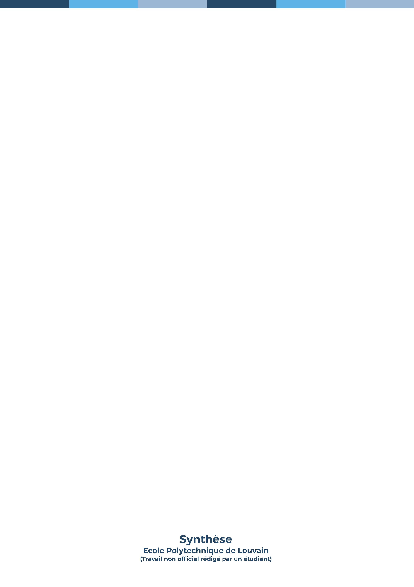

= UCLouvain Asciidoc Theme 
Théo Daron
2022
:toc:
:title-page:
:toc-title: Table des matières
:title-page-background-image: 
:icons: font
:doctype: book
:math:
:stem: latexmath
:imagesoutdir: stem

== Comment l'utiliser ?

Assurez vous d'avoir asciidoctor ainsi qu'asciidoctor-pdf d'installé !

Ensuite, il suffit de cloner ce repository, de choisir votre theme (Chaque branche = un thème)

Et vous n'avez qu'a editer ce fichier, le README, afin d'y mettre votre contenu

Et d'executer le script sh qui est fourni avec qui fera un build de votre fichier !

== Et pour les maths ?

Voici deux exemples

[latexmath]
++++
k_{n+1} = n^2 + k_n^2 - k_{n-1}
++++

[latexmath]
++++
x + y^2 = z
++++
