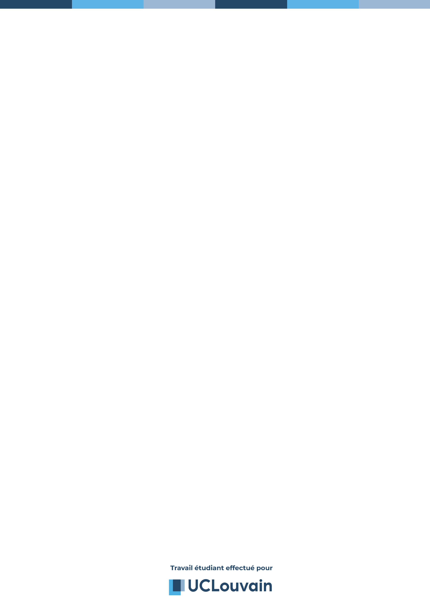

= La mécanique des fluides: Et son fonctionnement approfondi
Théo Daron
06895
:toc:
:title-page:
:toc-title: Table des matières
:title-page-background-image: 
:icons: font
:source-highlighter: rouge
:doctype: book

= Partie 1

== Plan de l'exposé

 Lorem ipsum dolor sit amet, consectetur adipiscing elit. Quisque vel lectus vitae purus aliquet aliquam. Ut at enim felis. Integer ullamcorper, ipsum sed viverra ornare, diam massa elementum enim, vitae porta risus ligula in urna. Interdum et malesuada fames ac ante ipsum primis in faucibus. In sit amet finibus sapien. Praesent dictum blandit nisi nec auctor. Sed vulputate nibh ut sem facilisis, in ullamcorper magna gravida. Praesent tellus erat, dapibus sed dui vitae, pulvinar interdum velit. Nunc a magna nec urna pretium tincidunt. Nunc sed odio lacinia, sollicitudin metus egestas, bibendum lacus. Nulla facilisis ornare lorem, sodales sodales metus feugiat vel. Aliquam erat volutpat. Vestibulum ante ipsum primis in faucibus orci luctus et ultrices posuere cubilia curae; Nunc molestie vestibulum est, eget dapibus velit tincidunt vel. Lorem ipsum dolor sit amet, consectetur adipiscing elit. Aliquam erat volutpat.

Aliquam erat volutpat. Proin convallis imperdiet lorem at porta. Aenean euismod erat non dolor interdum efficitur. Integer laoreet, dolor a molestie laoreet, diam sem ultrices leo, sed elementum quam nisi at massa. Vestibulum at imperdiet est. Quisque non libero tellus. Sed commodo augue id magna egestas imperdiet. Aenean maximus urna in dolor consectetur fermentum.

Aenean maximus imperdiet massa ac consequat. Vivamus sollicitudin a mi et convallis. Suspendisse commodo posuere ligula sed convallis. Donec volutpat lobortis mollis. Ut ultricies purus eget sagittis convallis. Morbi fringilla fringilla ligula in pharetra. Vestibulum eget purus euismod, varius dui et, ullamcorper libero. Morbi faucibus gravida felis, efficitur tincidunt tellus dignissim vel. Suspendisse potenti. Vivamus non enim a neque ornare porttitor. Mauris venenatis, urna ut sagittis maximus, urna ante fermentum lacus, id vulputate velit dolor et turpis. 

== Caractéristiques humanistes d'Érasme

 Vivamus est felis, ultrices eget massa nec, vulputate pulvinar leo. Sed quis magna in justo accumsan pretium. Phasellus dolor erat, tempor vitae nisl in, tincidunt faucibus diam. Pellentesque quis massa porta, accumsan tortor eget, consequat eros. Maecenas laoreet porttitor diam. Aliquam erat volutpat. Proin malesuada, lectus id dignissim fringilla, tortor mauris convallis nulla, quis congue urna eros eu lacus. Praesent gravida lacus ut justo tempor luctus. Etiam consequat, libero id tincidunt luctus, odio lorem ultricies lacus, nec cursus arcu augue vitae lectus. Vivamus iaculis lobortis pretium. Donec eget nisl in orci pellentesque fringilla sed pretium leo. Nulla vitae urna tellus. Integer lacinia augue at tortor ultricies, id commodo ex maximus. Phasellus congue elit felis, lacinia efficitur quam efficitur vitae. Sed ullamcorper, quam nec tempor rhoncus, libero est posuere sem, non pulvinar leo lectus posuere odio. Sed eget orci ut justo elementum dignissim in et nisi.

Quisque est orci, maximus vitae erat non, sagittis efficitur arcu. Nullam posuere erat ac ex bibendum, et porta elit maximus. Fusce nec turpis mi. Curabitur nec efficitur ex. Vivamus venenatis libero lectus, sed dapibus massa eleifend at. Duis vitae tortor non ligula sollicitudin rutrum vel maximus ex. Pellentesque porttitor justo non ultricies faucibus. Curabitur arcu tellus, varius quis congue id, ullamcorper et augue. Sed dignissim, metus sit amet laoreet porta, eros dui facilisis lectus, tristique maximus tortor odio vitae libero. Vivamus tristique est vel sapien facilisis, id dapibus leo viverra.

== Petit heading facile 

=== Un autre plus facile

==== Encore un autre haha 

===== Suppperrr

= Partie 2

Content entered directly below the header but before the first section heading is called the preamble.

== First level heading

This is a paragraph with a *bold* word and an _italicized_ word.

This is another paragraph.footnote:[I am footnote text and will be displayed at the bottom of the article.]

=== Second level heading

.Unordered list title
* list item 1
** nested list item
*** nested nested list item 1
*** nested nested list item 2
* list item 2

This is a paragraph.

.Example block title
====
Content in an example block is subject to normal substitutions.
====

.Sidebar title
****
Sidebars contain aside text and are subject to normal substitutions.
****

==== Third level heading

[#id-for-listing-block]
.Listing block title
----
Content in a listing block is subject to verbatim substitutions.
Listing block content is commonly used to preserve code input.
----

===== Fourth level heading

.Table title
|===
|Column heading 1 |Column heading 2

|Column 1, row 1
|Column 2, row 1

|Column 1, row 2
|Column 2, row 2
|===

====== Fifth level heading

[quote, firstname lastname, movie title]
____
I am a block quote or a prose excerpt.
I am subject to normal substitutions.
____

[verse, firstname lastname, poem title and more]
____
I am a verse block.
  Indents and endlines are preserved in verse blocks.
____

== First level heading

TIP: There are five admonition labels: Tip, Note, Important, Caution and Warning.

// I am a comment and won't be rendered.

. ordered list item
.. nested ordered list item
. ordered list item

The text at the end of this sentence is cross referenced to <<_third_level_heading,the third level heading>>

== First level heading

This is a link to the https://docs.asciidoctor.org/home/[Asciidoctor documentation].
This is an attribute reference {url-quickref}[that links this text to the AsciiDoc Syntax Quick Reference].

.Some Ruby code
[source,ruby]
----
require 'sinatra'

get '/hi' do
  "Hello World!"
end
----

.Some python code 
[source, python]
----
import requests

class Car: <1>
	def __init__(self, carName):
		self.name = carName # <2> 
	def sayHello(self):
		print(self.name) # <3>

#Let's create a car !
 
car = new Car("BMW") <4>

car.sayHello() <5>

----

<1> On crée une classe appelée Car 
<2> Dans notre constructeur, on définit la propriété name 
<3> On crée une fonction sayHello qui affiche la propriété name 
<4> On crée une voiture 
<5> On execute sayHello 
<6> Le point 6 n'existe pas !

<<<

[bibliography]
== Bibliographie

* [[[Babelio]]] Erasme. (2020). Babelio. Consulté le 28 avril 2022, à l’adresse https://www.babelio.com/auteur/-Erasme/11219

* [[[Lacharite]]] Beauchamp, J., & Lacharité, C. (2022). Érasme, le prince des humanistes [Podcast]. Écouté le 18 avril 2022, sur https://ici.radio-canada.ca/ohdio/premiere/emissions/aujourd-hui-l-histoire/segments/entrevue/195225/erasme-prince-humanistes-claude-charite

* [[[EvangileLiberte]]] Andrist, P. (s. d.). Érasme, le texte grec du Nouveau Testament. . . et l’ironie du destin. Évangile et Liberté. Consulté le 18 avril 2022, à l’adresse https://www.evangile-et-liberte.net/2020/12/la-bible-et-ses-langues/
